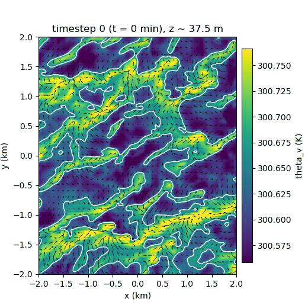

Cold Pool Detection and Tracking for RICO
==========================================

Detects and tracks cold pools in RICO LES data. Two modes: **time-tracking** (minute-by-minute with temporal evolution) and **static** (snapshot detection at individual timesteps).

## Setup

```bash
pip install -r requirements.txt
export RICO_DATA=/path/to/your/netcdf/files
```

## Usage

### 1. Time-Tracking Mode

**Best for:** High-frequency data (~1-min resolution), temporal evolution analysis

```bash
python main.py
```

Edit `config` dict in `main.py` to customize parameters. Key settings:
- `data_root`: Data directory (or use `RICO_DATA` env var)
- `z_index`: Vertical level (default: 2)
- `start_index`: Starting time index
- `detect_minutes`: How many minutes to process
- `lag_minutes`: Time lag between rain detection and boundary recognition (default: 7)
- Detection thresholds: `min_pool_area_km2`, `cover_rainy_min`, etc.

**Outputs:** Tracking GIFs, diagnostic plots

### 2. Static Detection Mode

**Best for:** Sparse data (hourly snapshots), large domains, quick exploratory analysis

**Command-line:**
```bash
python -m src.cold_pool_static --data_root /path/to/data --start_index 0 --n_steps 5
```

**Python API:**
```python
from src.cold_pool_static import run_static_detection

results = run_static_detection(
    data_root="/path/to/data",
    start_index=0,    # Starting time index
    n_steps=5,        # Number of timesteps to process
    z_index=2,        # Vertical level
)

# Access detected pools
for time_idx, pools in results.items():
    for pool in pools:
        print(f"Area: {pool.area_km2:.2f} km², centroid: {pool.centroid_km}")
```

**Outputs:** `plots/static_detection_t####.png` (only when cold pools detected)
- Left panel: theta_rho (density potential temperature) with boundaries
- Right panel: Relative humidity with boundaries
- Red contours: cold pool boundaries (d2_theta_rho/dr2 = 0 zero-crossings)
- Red stars: centroids

**Key differences from tracking mode:**
- No temporal lag (analyzes single timestep)
- No tracking between times
- No advection correction

## Algorithm

Cold pools are precipitation-driven density currents. Detection works like this:

1. **Rain seeding:** Find rainy regions (q_r > threshold) where evaporative cooling creates cold pools
2. **Radial boundary detection:** Find zero-contours of d2_theta_rho/dr2 (radial 2nd derivative of density potential temperature)
   - Cold pool interior: d2_theta_rho/dr2 < 0 (concave profile)
   - Gust front edge: d2_theta_rho/dr2 = 0 (inflection point)
   - Outside: d2_theta_rho/dr2 > 0 (ambient)
3. **Acceptance criteria:** Filter by proximity to rain, spatial overlap, and shape quality (aspect ratio, solidity)
4. **Tracking (time mode only):** Link detections using centroid distance and polygon overlap with optional wind advection

## Parameters

**Rain detection:**
- `qr_thresh_kgkg`: Rain threshold (None = adaptive per-timestep)
- `qr_max_height_m`: Column maximum height (default: 400m)
- `sigma_rain_smooth_m`: Smoothing scale (default: 150m)
- `min_pool_area_km2`: Minimum area (default: 0.2 km2)

**Boundary detection:**
- `hessian_sigma_m`: Smoothing for Hessian (default: 150m)

**Quality gates:**
- `proximity_factor`: Max distance from rain centroid (times rain diameter, default: 1.5)
- `cover_rainy_min`: Min rain coverage by polygon (default: 0.60)
- `cover_poly_min`: Min polygon coverage by rain (default: 0.10)
- `aspect_min`: Min aspect ratio (default: 0.40)
- `solidity_min`: Min solidity (default: 0.55)

## Notes

- Uses theta_rho (density potential temperature) not theta_v to account for condensate loading
- If `rico.r.nc` missing, assumes no rain (q_r = 0)
- All plots saved to `plots/` directory

## Sample


